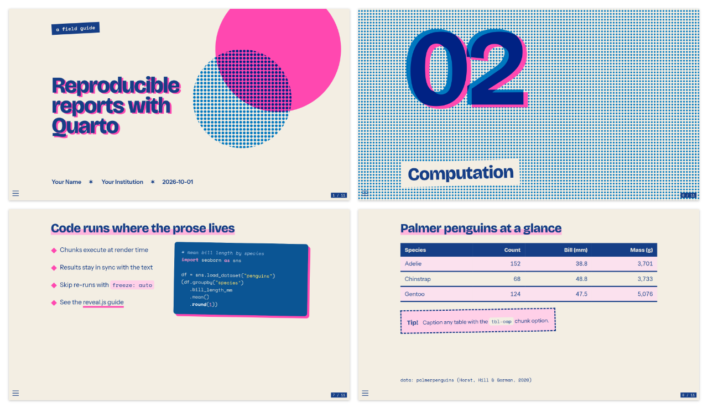
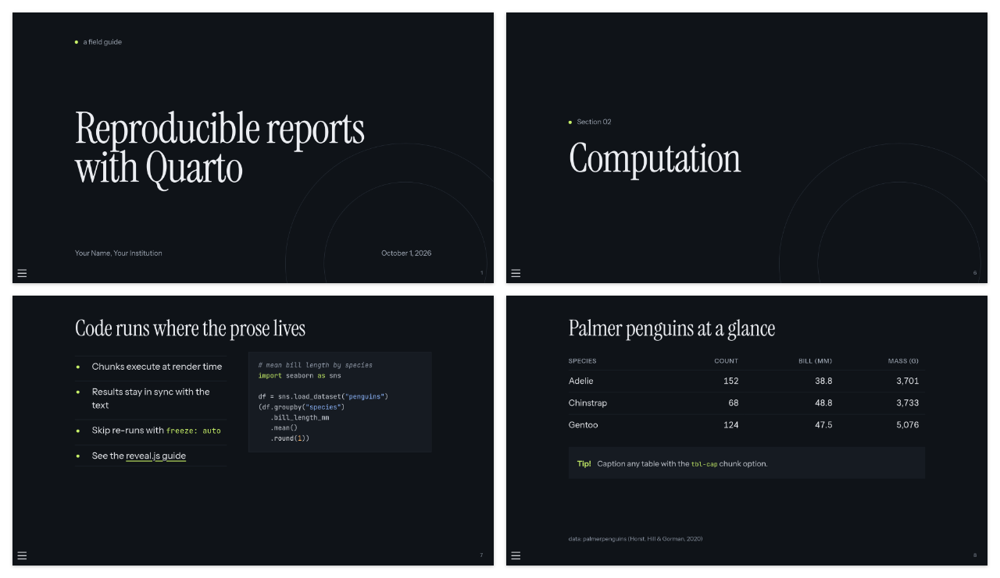
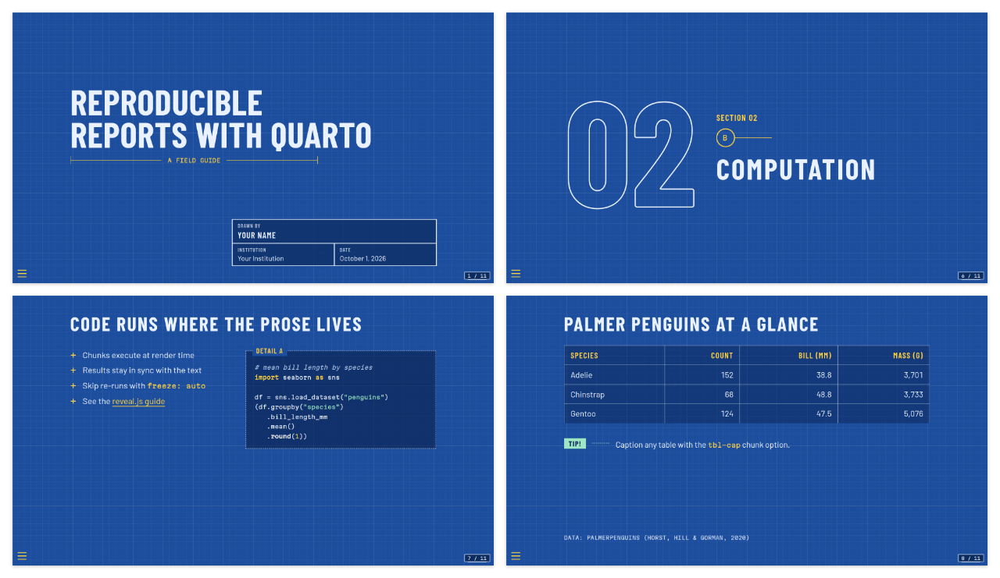
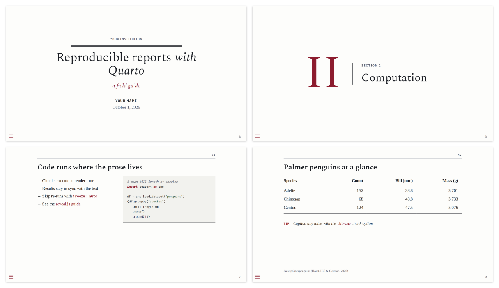

# Quarto Reveal.js Themes

A collection of themes for [Quarto](https://quarto.org/) reveal.js presentations.
Every theme renders the same sample deck ([`template.qmd`](template.qmd)), so you
can compare them side by side on the
[live gallery](https://jansim.github.io/quarto-revealjs-themes/).

| Theme | Format | Preview |
|-------|--------|---------|
| **[Riso Zine](https://jansim.github.io/quarto-revealjs-themes/themes/riso.html)**: two risograph inks on uncoated paper, with halftone fields and misregistered type | `riso-revealjs` | [](https://jansim.github.io/quarto-revealjs-themes/themes/riso.html) |
| **[Nocturne](https://jansim.github.io/quarto-revealjs-themes/themes/nocturne.html)**: dark keynote, with serif drama on near-black, quiet orbit lines and one luminous accent | `nocturne-revealjs` | [](https://jansim.github.io/quarto-revealjs-themes/themes/nocturne.html) |
| **[Blueprint](https://jansim.github.io/quarto-revealjs-themes/themes/blueprint.html)**: technical drawing on cyanotype blue, with a faint grid, dimension lines and a title block | `blueprint-revealjs` | [](https://jansim.github.io/quarto-revealjs-themes/themes/blueprint.html) |
| **[Scholar](https://jansim.github.io/quarto-revealjs-themes/themes/scholar.html)**: the journal article, projected, with book serifs, booktabs tables, running heads and small-caps labels | `scholar-revealjs` | [](https://jansim.github.io/quarto-revealjs-themes/themes/scholar.html) |

## Use

Add the themes to an existing project:

```bash
quarto add jansim/quarto-revealjs-themes
```

then pick one in your document's front matter:

```yaml
format: riso-revealjs
```

Or start a new project from the sample deck:

```bash
quarto use template jansim/quarto-revealjs-themes
```

## Repository layout

```
_extensions/<id>/      one Quarto extension per theme (contributes <id>-revealjs)
template.qmd           the shared sample deck every theme renders
themes/<id>.qmd        tiny page per theme: includes template.qmd, sets format
themes.yml             theme registry, drives the landing page listing
index.qmd              landing page (gallery of themes.yml)
_quarto.yml            website project: renders index.qmd + themes/*.qmd to _site/
util/                  build tooling, kept out of the way:
  screenshots.mjs      Playwright script: _site/themes/*.html -> screenshots/<id>/
  new-theme.sh         scaffolds a new theme (extension, page, registry entry)
  package.json         Node deps for the screenshots (Playwright only)
```

How the pieces fit together:

1. Each page in `themes/` pulls in the sample deck with
   `` and then sets `format: <id>-revealjs` in a
   front matter block *after* the include. The last block wins, so its `format`
   overrides the one in the template and the same content renders with each theme.
2. `quarto render` builds the website: the landing page plus one deck per theme
   at `_site/themes/<id>.html`.
3. `npm --prefix util run screenshots` opens each rendered deck in headless Chromium and
   captures the title, a section, the code and the table slides into
   `screenshots/<id>/`, plus a 2x2 overview at `screenshots/<id>.png` (all also
   copied into `_site/`). Only `screenshots/<id>.png` is committed (for this
   README); the per-slide images, including the landing page thumbnails, are
   regenerated on every build.
4. The GitHub Actions workflow runs both steps and deploys `_site/` to
   GitHub Pages.

The template uses a fixed date and no executable code chunks, so renders are
deterministic and CI needs neither R nor Python.

## Development

Requirements: Quarto ≥ 1.4, plus Node ≥ 18 for the screenshots only.

```bash
npm --prefix util install
npx --prefix util playwright install chromium   # once
npm --prefix util run build                     # quarto render + screenshots
quarto preview                                  # live preview while editing a theme
```

Commit the updated `screenshots/<id>.png` so the README previews stay current.

### Adding a theme

```bash
util/new-theme.sh swiss "Swiss Grid"
```

This creates `_extensions/swiss/`, `themes/swiss.qmd` and a `themes.yml` entry.
Then style `_extensions/swiss/swiss.scss` and run `npm --prefix util run build`.

Besides the usual Quarto/reveal.js elements, the sample deck uses a few classes
that every theme should style:

| Class | Used for |
|-------|----------|
| `[text]{.alert}` | strong emphasis in the accent colour |
| `[text]{.highlight}` | marker-style highlight |
| `[text]{.sticker}` | a small label or tag |

Section slides (`# Heading`) and the title slide are also worth giving a
distinct look.
